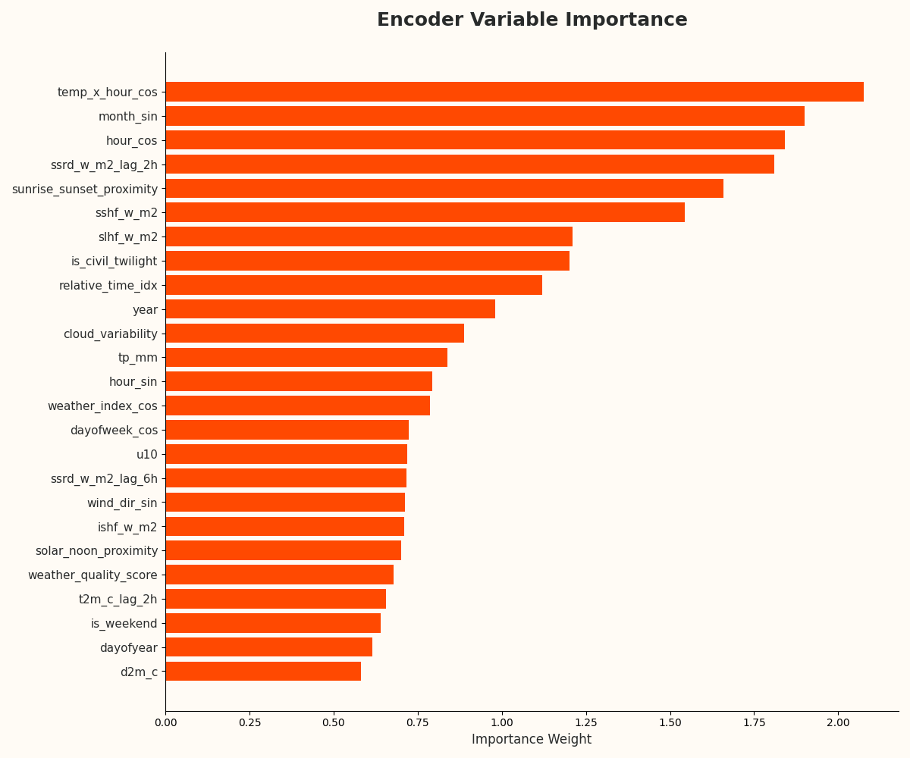
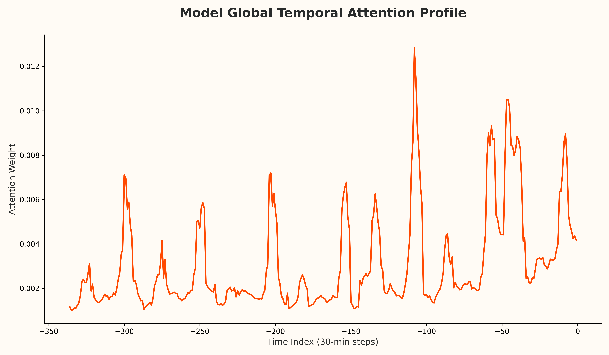
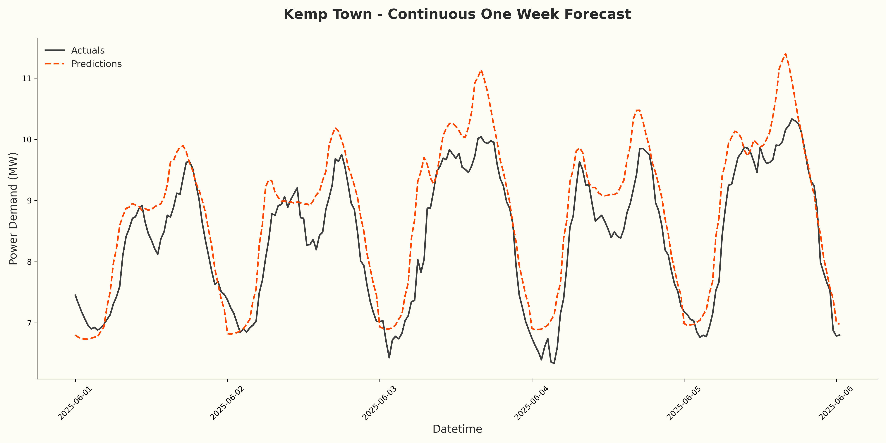

# UK Power Flow to Embedded Solar Capacity

- Inferring behind-the-meter PV capacity
- Producing operational solar power forecasts.
- For approximately 600 UK primary substation locations.

---

## Problem Formulation - Embedded Capacity Estimation

Domestic level solar panels feed directly into the local network without being metered at the substation. The more solar capacity exists behind the meter, the lower the observed demand reading during daylight hours. This hence creates a fundamental observability problem without directly seeing how much of any apparent demand reduction is driven by solar generation versus genuine changes in consumption.

Without knowing how much solar is installed at each of the primary substations across the UKPN network, operators cannot accurately forecast future flows, plan for constraint management, or assess headroom available for flexibility services.

The aim of this project is to uncover hidden solar capacity figures purely from historical substation power readings and co-located weather data.

The main inference objective is hence to recover installed domestic capacity from historical residual signal - without direct metering.

---

## Data

| Source | Description | Resolution |
|---|---|---|
| UKPN | Half-hourly active power per primary substation | 30 min |
| ERA5 | Reanalysis weather variables (SSRD, T2M, U10, TP, etc.) | Hourly interpolated |
| PVLive (Sheffield Solar) | GSP-level aggregated PV generation actuals | 30 min |

**Coverage**: Approximately 600 UKPN primary substations across the South East and East of England.

**Feature engineering** including but not limited to: solar zenith/azimuth proxies (`solar_noon_proximity`, `sunrise_sunset_proximity`, `is_civil_twilight`), lagged irradiance (`ssrd_w_m2_lag_2h`, `ssrd_w_m2_lag_6h`), cyclical time encodings (`hour_sin`, `hour_cos`, `month_sin`, `dayofweek_cos`), and cloud/weather quality indices.

---

## Model Architecture

### Temporal Fusion Transformer (TFT)

The primary forecasting model utilised is a modified [Temporal Fusion Transformer](https://arxiv.org/abs/1912.09363) (Lim et al., 2021), implemented via `pytorch-forecasting`.

**Architectural modifications:**

- LSTM encoder and decoder cells replaced with GRU units, reducing parameter count while retaining sequential inductive bias and improving both training stability and speed.

- An optional attention-head diversity regularisation term is added to the training loss:

$$\mathcal{L}_{\text{total}} = \mathcal{L}_{\text{SMAPE}} + \lambda \cdot \Omega_{\text{div}}$$

where:
- $\mathcal{L}_{\text{total}}$ — total training loss.
- $\mathcal{L}_{\text{SMAPE}}$ — symmetric mean absolute percentage error between predicted and actual power values.
- $\lambda$ — regularisation strength, controlling how much the diversity term influences training.
- $\Omega_{\text{div}} = \frac{1}{\binom{H}{2}} \sum_{i < j} \langle \mathbf{a}_i, \mathbf{a}_j \rangle$ — mean pairwise cosine similarity across all $H$ attention heads; penalising this encourages each head to specialise on different temporal patterns rather than learning redundant representations.

**Scheduler**: Cosine annealing with $\eta_{\min} = 0.01 \cdot \eta_0$, where $\eta_0$ is the initial learning rate and $\eta_{\min}$ is the minimum it decays to. Switchable to `ReduceLROnPlateau` via config.

**Target normalisation**: Per-group softplus normalisation via `GroupNormalizer`, applied independently per substation.

*Top 25 encoder variable importance weights. Interaction feature `temp_x_hour_cos` and seasonal encoding `month_sin` dominate, alongside 2-hour lagged irradiance and sunrise/sunset proximity.*

*Aggregated temporal attention weights across the encoder window. Peaks correspond to identical timestamp lookbacks on previous days.*

*Continuous one-week forecast for randomly selected primary substation - June 2025. The TFT captures daily demand cycles closely, with minor overestimation on high-irradiance afternoons.*

---

## Capacity Estimation: On-Manifold Method (cVAE)

Rather than constructing synthetic weather scenarios from scratch — which can produce physically implausible conditions — the model first learns what real weather actually looks like at each site, then generates scenarios that are guaranteed to stay within that observed range.

**Stage 1 — Learning the weather distribution.** A neural network (cVAE) is trained on years of historical ERA5 weather, learning a compact representation of typical conditions per site, month, and hour. Training minimises:

$$\mathcal{L} = \text{reconstruction error} + \text{latent regularisation}$$

where the reconstruction error penalises the network for generating weather vectors that differ from real observations, and the latent regularisation keeps the learned space smooth and continuous so that new samples remain physically plausible.

**Stage 2 — Generating extreme scenarios.** The model generates $k$ plausible weather vectors for a given site and time. Each is scored by how solar-favourable it is:

$$s = \sum_j w_j x_j$$

where $x_j$ is the value of weather feature $j$ (e.g. irradiance, cloud cover) and $w_j$ is a configured weight reflecting how strongly that feature drives solar generation (positive for irradiance, negative for cloud cover). The bottom 20% of scores become the *low-solar* pool; the top 20% become the *high-solar* pool.

**Stage 3 — Estimating capacity.** For each of $N$ draws, the TFT is run under both a low- and high-solar scenario. The difference in predicted power is the estimated solar contribution:

$$\Delta_n = \max(0,\ \hat{P}^{+}_n - \hat{P}^{-}_n)$$

where $\hat{P}^{+}_n$ is the predicted power under high-solar conditions and $\hat{P}^{-}_n$ under low-solar conditions for draw $n$. The $\max(0, \cdot)$ ensures only positive deltas contribute — i.e. cases where more sun genuinely reduces net demand. Capacity is the mean delta across all draws:

$$\hat{C} = \frac{1}{N} \sum_{n=1}^{N} \Delta_n$$

with P95 across the $N$ draws reported as an uncertainty bound.
