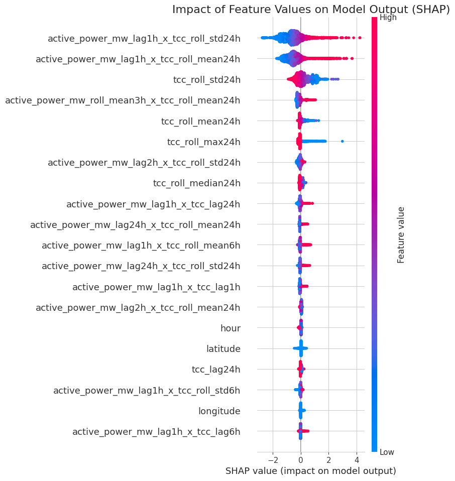

# UK Solar Power & Embedded Solar Capacity Estimation

A repository for forecasting primary transformer power using XGBoost and subsequently estimating embedded capacity.
Core of the approach is utilising the trained model as a counterfactual baseline for capacity estimation.

## Major Functionality

* **Time-Series Forecasting**: Trains an `XGBoost` model to predict half-hourly power demand at primary transformer sites based on historical power flow and ERA5 weather data (total cloud cover, solar radiation, temperature).
* **Embedded Capacity Estimation**: Utilises the trained model as an effective 'digital twin' to hence estimate the unmetered solar generation capacity within the network. Two distinct methodologies are considered for this further stage: "Dummy Weather" and "Historical Analogy".

## Visualisations

The following graphs from the project's preliminary report illustrate key data and findings.

**(Figure 1) Map of Selected Transformers**
A map displaying the initial 20 transformer sites selected for the analysis, chosen to ensure geographical diversity as a basis across the UKPN network.


**(Figure 2) Power Reduction vs. Solar Irradiance**
A time-series plot for the Kingsbury site displaying the inverse relationship between net power demand and solar irradiance (`SSRD`) - demonstrating the impact of PV generation.


**(Figure 3) Model Forecast Performance**
Comparing the actual power flow against the XGBoost model's predicted power on the test set for the Marshalswick site - demonstrating high forecast accuracy (LSTM and CNN also considered).


**(Figure 4) SHAP Summary of Feature Importance**
A SHAP summary plot for XGBoost model's predictions. It indicates that an interaction between lagged power and cloud cover is the most impactful feature.


**(Figure 5) Scenario Simulation Site Specific**


**(Figure 6) Embedded Capacity Distribution**


## Technical Architecture

* **Source / Main Pipeline**: The project is structured as a series of distinct, scriptable stages: data loading/unzipping, preprocessing, feature engineering, model training, and scenario analysis.
* **Configuration**: All parameters, paths, and hyperparameters are centrally located in the `config.yaml` file.
* **Core Libraries**: Not limited to: `pandas`, `xgboost`, `scikit-learn`, and `xarray` / `pyproj`.
* **External Data**: Integrates UKPN power data, ERA5 meteorological data, and Passiv installed PV capacity data.

## Data Cleaning & Processing Stages

* **Source Data**: The primary dataset is the "UKPN Primary Transformer - Historic Half Hourly" power flow data, covering the period from January 1, 2021, to December 31, 2024.
* **Data Quality Issues Addressed**:
    * **Negative Power Values**: Absolute value of power readings is utilised to correct for measurement conventions that hence result in negative values.
    * **Duplicate Entries**: Duplicate readings for single timestamp are resolved via retaining the first instance.
    * **Temporal Harmonisation**: The native half-hourly power data is resampled to a uniform hourly frequency by taking the mean to align with the hourly ERA5 weather data.

## Installation

Clone repository and install necessary dependencies in editable mode with the `dev` extras.

```bash
git clone https://github.com/openclimatefix/uk-power-flow-to-solar-capacity
cd uk-power-flow-to-solar-capacity
pip install -e ".[dev]"